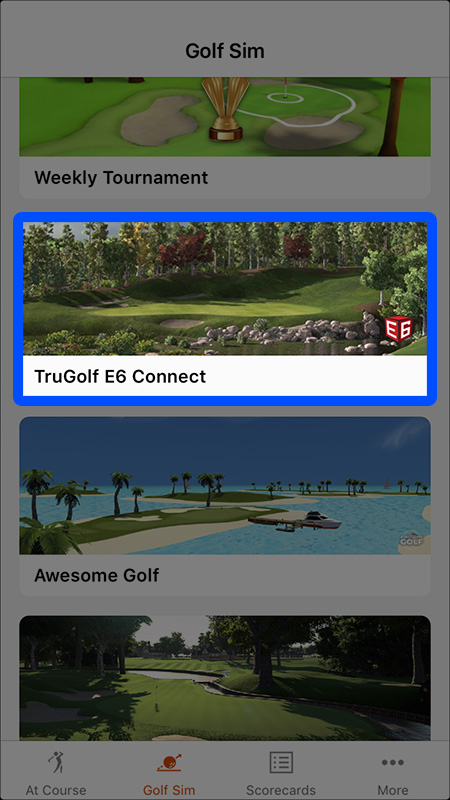
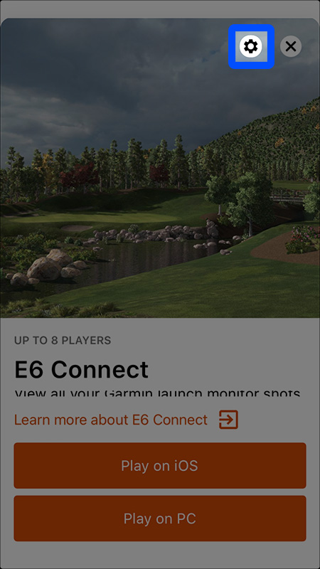
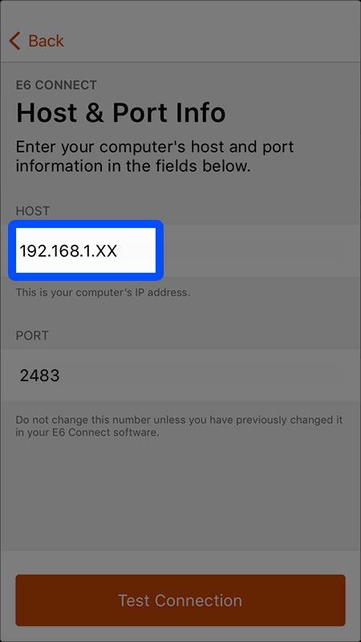
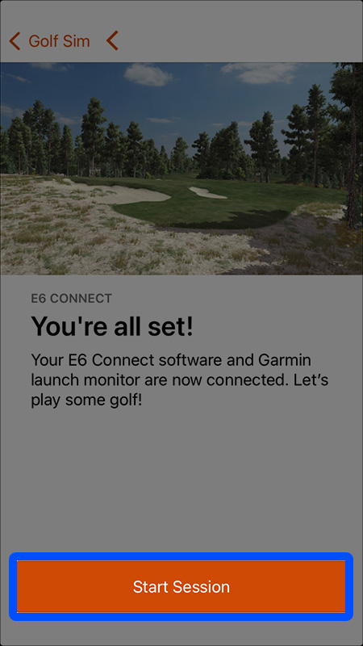

## Garmin Approach R10 Setup Guide

This guide will walk you through the steps to use your Garmin Approach R10 with GSPro Golf Simulator, using the [Approach R10 Connect](./index) app.

1. Download and install the [Garmin Golf](https://www.garmin.com/en-US/p/590068) app for iOS or Android. Use Bluetooth to pair your Garmin Approach R10 with your smartphone or tablet running the Garmin Golf app. Then from the app menu, select **Garmin Devices > Add Device**, and follow the on-screen instructions.

> Note: The first time you turn on the device, it automatically enters pairing mode, and the status LED is solid blue. You can also hold the button while the device is off until the status LED turns solid blue to manually enter pairing mode. [More information](https://tinyurl.com/yzwh468u)

<table>
  <tr>
    <td>
    2. Once you've paired your Approach R10 with the Garmin Golf app, select the **TruGolf E6 Connect** option. (The Approach R10 Connect app mimics the E6 API to collect the shot data sent to GSPro)
    </td>
    <td halign="center" width="200">
      
    </td>
  </tr>
  <tr>
    <td>
3. The first time we use this option, we'll need do some setup. On the next screen click the **Gear** icon.
    </td>
    <td halign="center">
      
    </td>
  </tr>
  <tr>
    <td>
4. Enter the **Host** (ip address) of the computer running GSPro, which is displayed in the **Approach R10 Connect** app. (You shouldn't have to change the port)
    </td>
    <td halign="center">
      
    </td>
  </tr>
  <tr>
    <td>
5. Select **Test Connection**. If everything connected ok, you should now be able to select **Start Session**, or **Play on PC** from the main menu.
    </td>
    <td halign="center">
      
    </td>
  </tr>

</table>

 

  
Huzzah! 🎉 Now your shots should now be flowing to GSPro, assuming you've <a href="connect-gspro">set that up</a> as well. May The Fores Be With You!

  

### Up Next: [Connecting GSPro](./connect-gspro)
