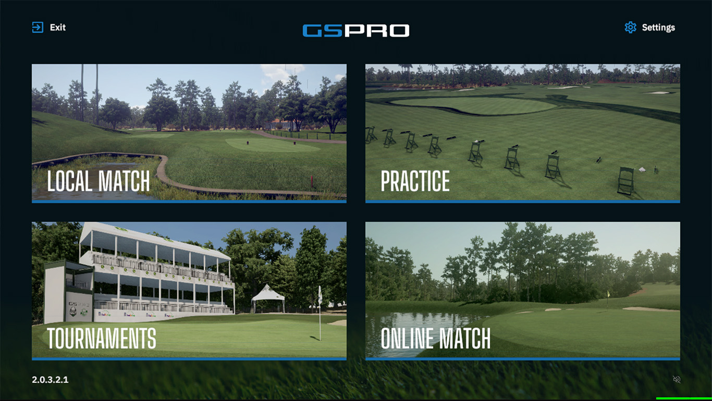
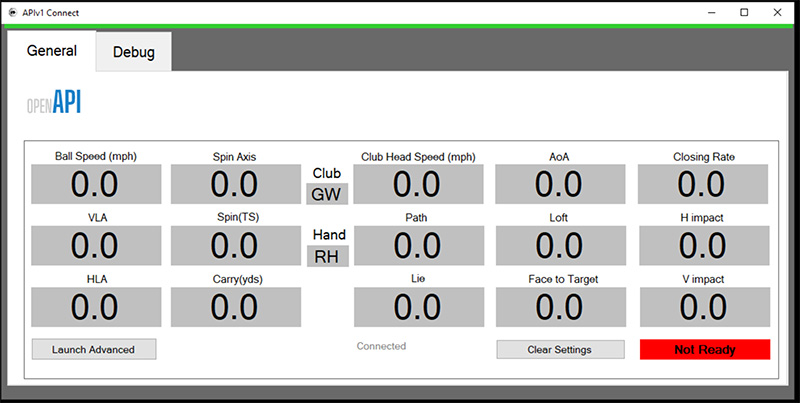

## GSPro Setup Guide

1. Open **GSPro** and select **GSPro Connect API** as your Launch Monitor source.
2. Start the game from the GSPro Launch Menu, and the **APIv1 Connect** window should open as well.

| GSPro                                        | Connect API                                         |
| -------------------------------------------- | --------------------------------------------------- |
|  |  |

> Note: If GSPro opened in fullscreen, and you don't see the other windows, you can press `F11` to toggle GSPro into windowed mode.

3. If everything went ok, both the **GSPro APIv1 Connect** and **Connect R10** app should now indicate they are connected.

> Note: It shouldn't matter which order you launch GSPro or the **Connect R10** app, but there's a bug with **APIv1 Connect**, where it won't reestablish a connection if the **Connect R10** application exits. If you find your self unable to send shot data, simply restart the GSPro or the **APIv1 Connect** application to reconnect.

### Up Next: [Connecting the Approach R10](./connect-approach-r10)
