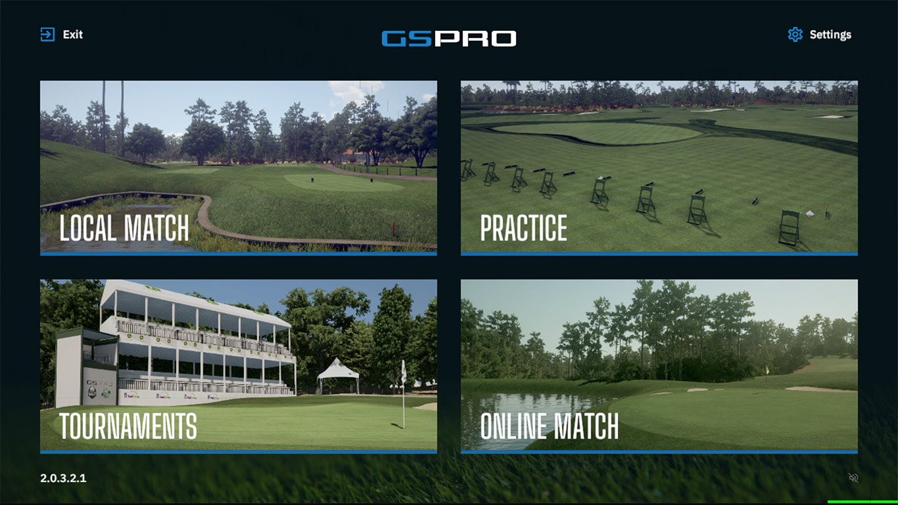
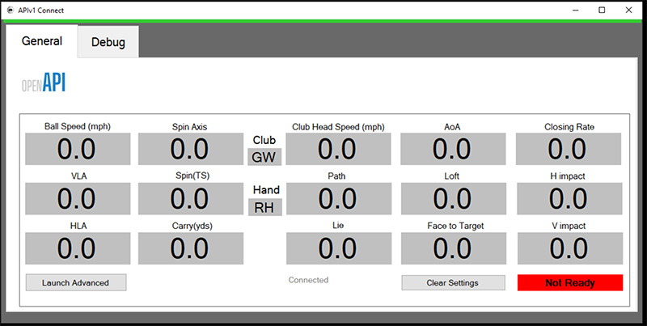
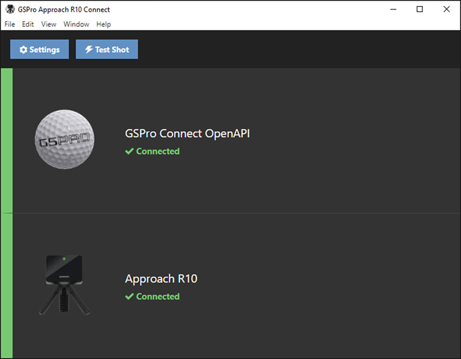

# GSPro Connect R10

Welcome to the GSPro Connect R10 guide! This app makes it easy to connect your Garmin Approach R10 to the GSPro Software.

<a href="https://github.com/dudewheresmycode/gspro-openconnect-approach-r10/releases">Download</a>

## Install and Run GSPro Connect R10

Download the `.exe` file from the releases page, and follow the instructions to install it.

> Note: Windows may warn about this software coming from an untrusted developer. For now, you'll need to click **More Info > Run anyway**, until we've setup code signing.

Once you've downloaded, installed, and opened this app for the first time, there are just a couple more steps to get everything connected.

## Connecting GSPro

1. Open the GSPro app and select GSPro Connect API as your Launch Monitor source.
2. Start the game from the GSPro Launch Menu, and the APIv1 Connect app should open as well.

> Note: If GSPro opened in fullscreen, and you don't see the other windows, you can press `F11` to toggle GSPro into windowed mode. 3. If everything went ok, both the **GSPro APIv1 Connect** and **Connect R10** app should now indicate they are connected.

> Note: It shouldn't matter which order you launch GSPro or the **Connect R10** app, but there's a bug with **APIv1 Connect**, where it won't reestablish a connection if the **Connect R10** application exits. If you find your self unable to send shot data, simply restart the GSPro or the **APIv1 Connect** application to reconnect.

## Connect R10 to Garmin App

1. Use Bluetooth to pair your Garmin Approach R10 with your smartphone or tablet running the Garmin Golf app. [More information](https://tinyurl.com/yzwh468u)
2. Select **TruGolf E6 Connect**
3. Click the **Settings** icon
4. Enter the **Host** (ip address) and **Port** displayed in the **R10 Connect** app
5. Select **Test Connection**
6. If everything connected ok, you should now be able to select **Play on PC > Start Session**

 

 
 

Huzzah! 🎉 Now your shots should be flowing to GSPro. May The Fores Be With You!

